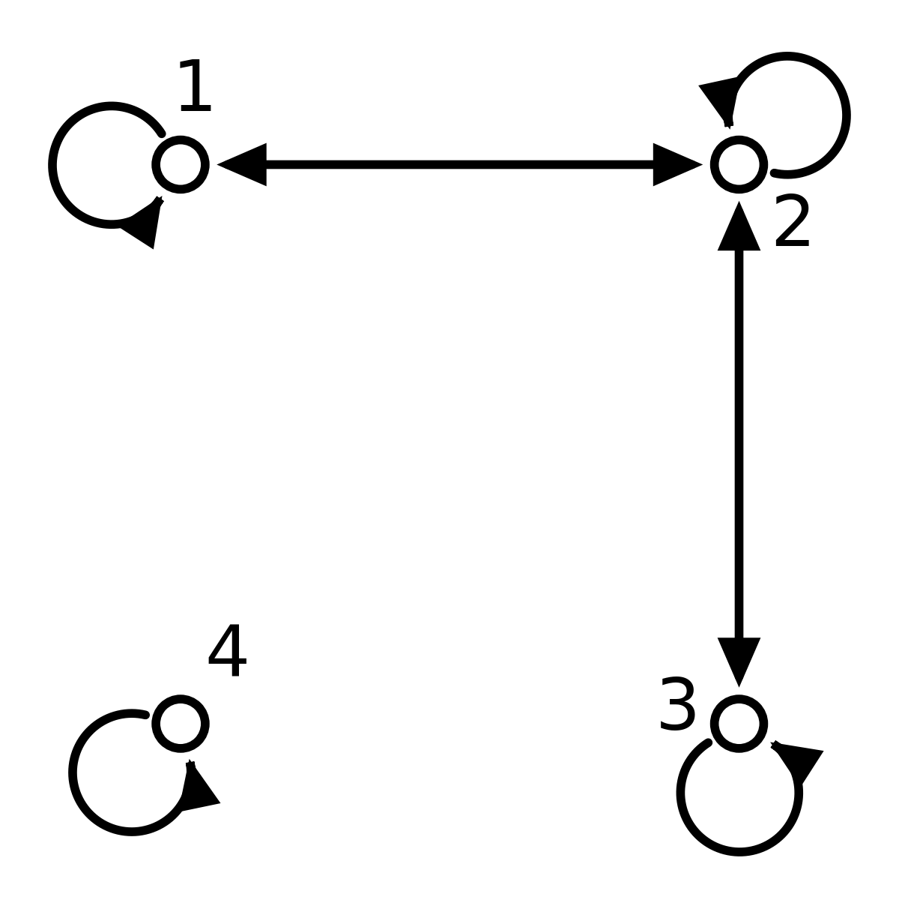
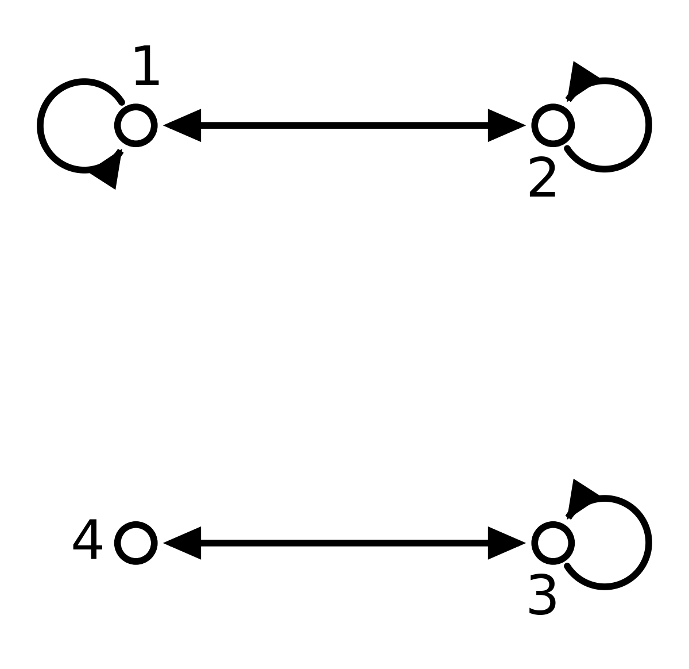
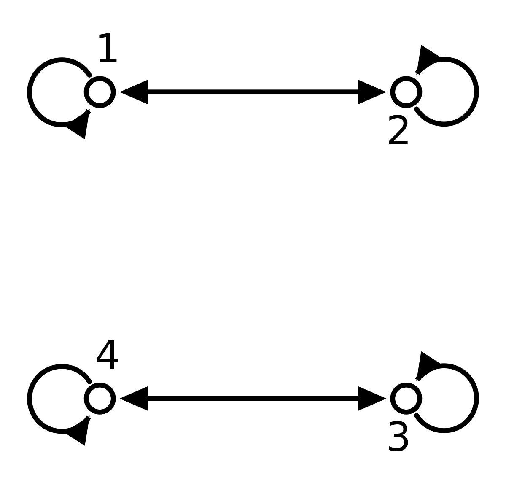
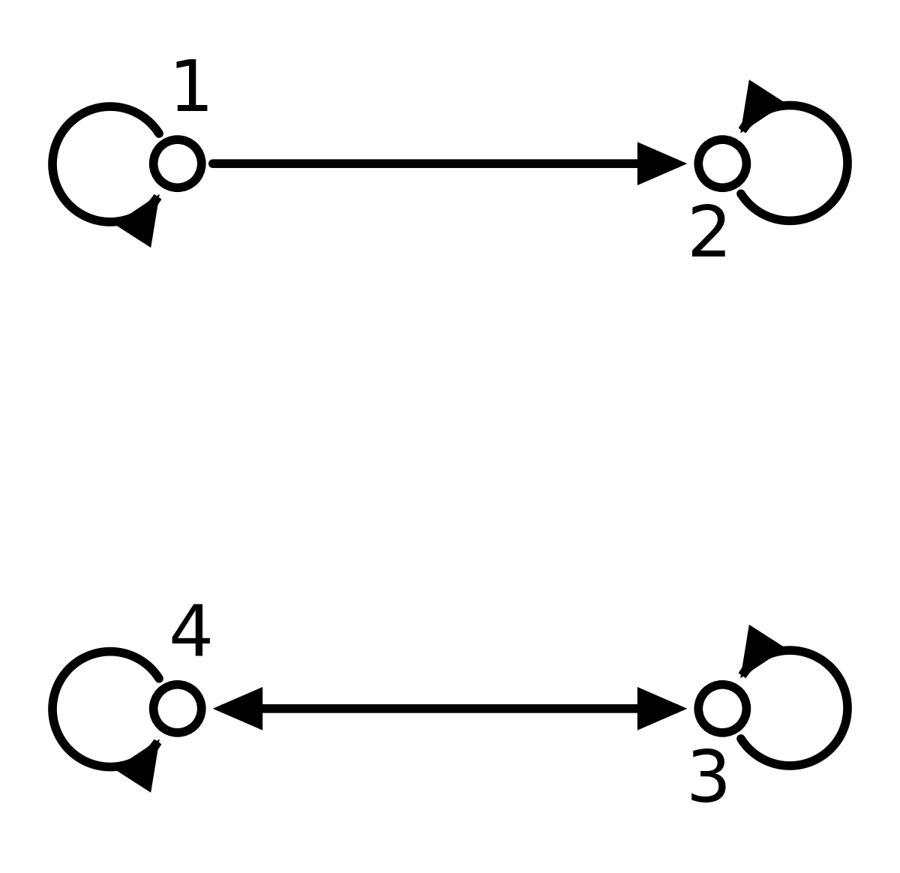
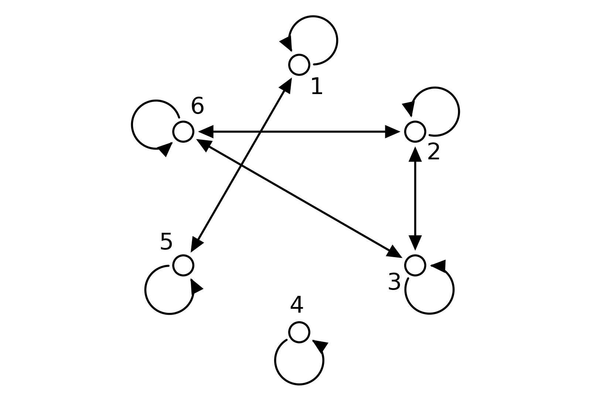
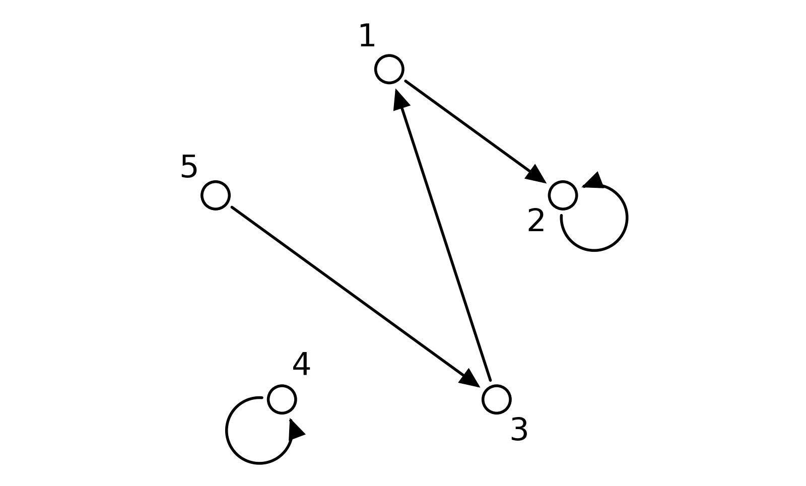
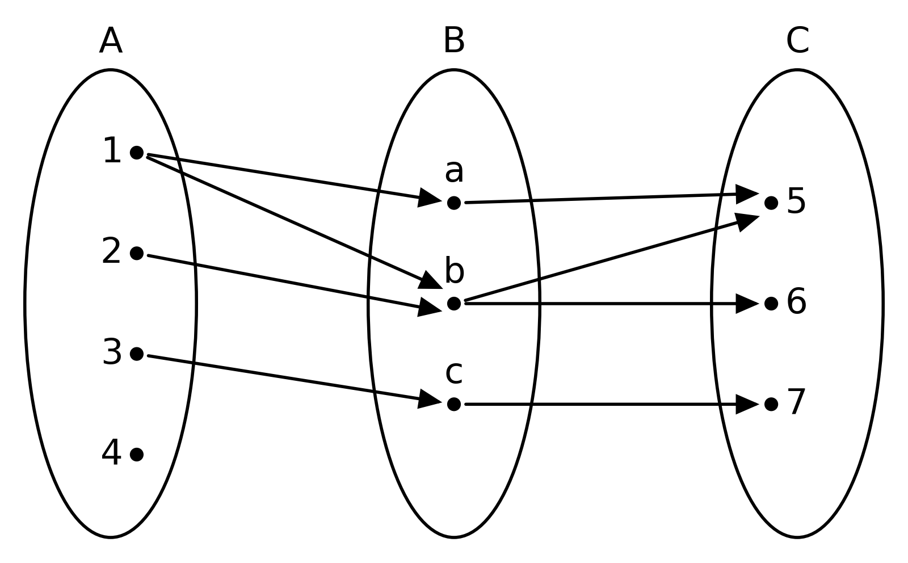
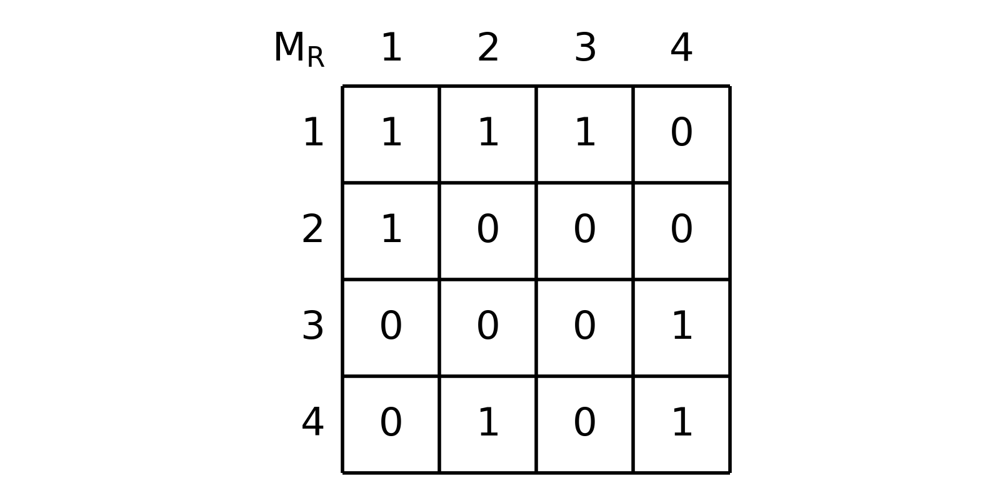
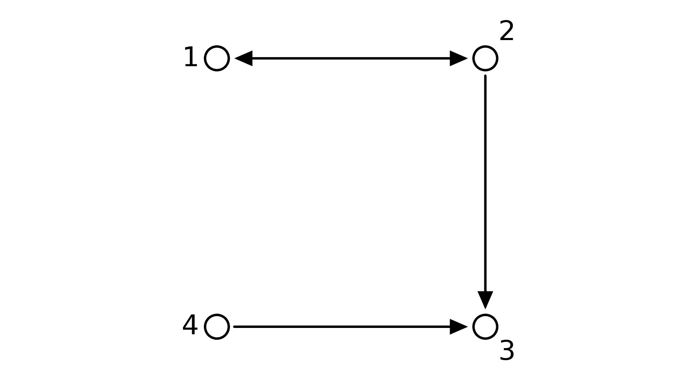
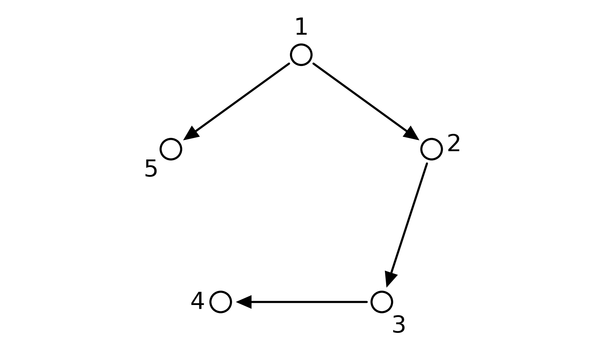

# Блок 1. Один верный вариант

## 1

$R \subseteq A^2$ — отношение эквивалентности на $A$, если $R$:

- ( ) рефлексивно, антисимметрично и транзитивно
  > Так устроено отношение $\subseteq$ на подмножествах (слайды 3–8). Если есть пара $(a, b)$ с $a \ne b$, обратной пары в нём нет, и симметричность нарушена.
- ( ) симметрично и транзитивно
  > Не хватает рефлексивности. Пример: $A = \{1, 2\}$, $R = \{(1, 1)\}$ симметрично и транзитивно, но элемент 2 не связан даже сам с собой и не попадает ни в один класс.
- (x) рефлексивно, симметрично и транзитивно
- ( ) рефлексивно, симметрично и антитранзитивно
  > Если в классе есть $a \ne b$, то $aRb$ и $bRa$, и по транзитивности должно быть $aRa$. Антитранзитивность запрещает ровно это.

Подсказка: Эквивалентность — обобщение равенства. Какими свойствами обладает «$a = b$»?

Пояснение:
**Ответ:** рефлексивно, симметрично и транзитивно.

> **Слайд 12.** Под заголовком «Эквивалентные» перечислены три свойства: рефлексивность, симметричность, транзитивность.
>
> **Слайд 16** говорит то же на языке графа: «везде петли = рефлексивно», «только ребра = симметрично», «транзитивные тройки = транзитивно».

Смысл каждого свойства:

- **рефлексивность:** каждый элемент эквивалентен сам себе;
- **симметричность:** если $a$ эквивалентен $b$, то и $b$ эквивалентен $a$;
- **транзитивность:** эквивалентные одному и тому же эквивалентны между собой.

Равенство, «учиться в одной группе», «давать одинаковый остаток при делении на 3» — всё это отношения эквивалентности.

## 2

$A = \{1, 2, 3, 4\}$, $R = \{(1, 1), (2, 2), (3, 3), (4, 4), (1, 3), (3, 1)\}$ — отношение эквивалентности на $A$.

Класс эквивалентности элемента 1 — это множество всех элементов, связанных с 1. Обозначается $[1]$. $[1] = ?$

- ( ) $\{(1, 1), (1, 3)\}$
  > Это пары отношения. Класс эквивалентности состоит из элементов $A$, а не из пар.
- (x) $\{1, 3\}$
- ( ) $\{3\}$
  > Элемент всегда лежит в своём классе: $(1, 1) \in R$, поэтому $1 \in [1]$.
- ( ) $\{2, 4\}$
  > Это как раз элементы, которые с 1 не связаны. Они лежат в других классах: $[2] = \{2\}$, $[4] = \{4\}$.

Подсказка: Выпишите все пары, в которых участвует 1. Какие элементы стоят в них рядом с 1?

Пояснение:
**Ответ:** $[1] = \{1, 3\}$.

> **Слайд 44.** «[а] = { x: (x,а) ∈ R } – класс эквивалентности, порожденный элементом а».

1. С единицей связаны 1 (пара $(1, 1)$) и 3 (пара $(3, 1)$).
2. Значит, $[1] = \{1, 3\}$.

Остальные классы: $[2] = \{2\}$, $[4] = \{4\}$, и $[3] = \{1, 3\} = [1]$. Классы не пересекаются и вместе дают всё $A$: $\{1, 3\}$, $\{2\}$, $\{4\}$ — это разбиение $A$.

## 3

$R \subseteq A \times B$, $S \subseteq B \times C$. $R \circ S = ?$

- ( ) $\{(a, c) \mid \forall b \in B: (a, b) \in R \land (b, c) \in S\}$
  > $\forall b$ вместо $\exists b$: промежуточный элемент нужен один, требовать его для всех $b \in B$ слишком сильно.
- ( ) $\{(a, c) \mid \exists b \in B: (a, b) \in S \land (b, c) \in R\}$
  > $R$ и $S$ поменяны местами. У пар из $S$ первый элемент из $B$, поэтому $(a, b) \in S$ для $a \in A$ в общем случае не имеет смысла.
- ( ) $\{(a, b, c) \mid (a, b) \in R \land (b, c) \in S\}$
  > Композиция — отношение, то есть множество пар, $R \circ S \subseteq A \times C$. Промежуточный $b$ в ответ не попадает.
- (x) $\{(a, c) \mid \exists b \in B: (a, b) \in R \land (b, c) \in S\}$

Подсказка: Композиция — это «два шага»: сначала по $R$, потом по $S$. Сколько промежуточных элементов нужно, чтобы пройти путь?

Пояснение:
**Ответ:** $R \circ S = \{(a, c) \mid \exists b \in B: (a, b) \in R \land (b, c) \in S\}$.

> **Слайд 54** (формулы на слайде написаны от руки). «Композиция отношений R⊆A×B и S⊆B×C есть отношение T на A × C: T = {(a,c) | ∃b ∈ B: (a,b) ∈ R и (b,c) ∈ S}, T = R∘S».

Как читать: пара $(a, c)$ попадает в $R \circ S$, если из $a$ можно дойти до $c$ за два шага: сначала по $R$ в какой-нибудь $b$, потом по $S$ из $b$ в $c$. В записи $R \circ S$ первым применяется $R$.

## 4

Степень отношения $R^n$ — это пары $(a, b)$, для которых из $a$ в $b$ можно пройти ровно за $n$ шагов по парам $R$: $R^1 = R$, $R^2 = R \circ R$ и так далее.

$A = \{1, 2, 3\}$, $R = \{(1, 2), (2, 3)\}$. Какие пары лежат в $R^0$, то есть проходятся за ноль шагов?

- ( ) $\varnothing$
  > «Ноль шагов» — это остаться на месте. Из любого элемента можно никуда не идти, поэтому пары в $R^0$ есть.
- (x) $\{(1, 1), (2, 2), (3, 3)\}$
- ( ) $R$
  > За один шаг проходятся пары $R$. Это $R^1$, а не $R^0$.
- ( ) $\{(1, 1), (2, 2)\}$
  > Остаться на месте можно и в 3, хотя из 3 не выходит ни одной стрелки. $R^0$ не зависит от пар $R$.

Подсказка: Куда можно попасть из 1, не сделав ни одного шага? А из 3?

Пояснение:
**Ответ:** $R^0 = \{(1, 1), (2, 2), (3, 3)\}$.

> **Слайд 65** (записано от руки): $R^n = R^{n-1} \circ R$, $R^1 = R$, $R^0 = \{(x, x) \mid x \in A\}$.

$R^0$ — петли $(x, x)$ для каждого $x \in A$, от пар $R$ оно не зависит. Проверка по формуле $R^1 = R^0 \circ R$:

- петля $(x, x)$ из $R^0$ и пара $(x, y)$ из $R$ дают $(x, y)$, поэтому $R^0 \circ R = R$, как и должно быть;
- с $R^0 = \varnothing$ получилось бы $R^1 = \varnothing$, а с $R^0 = R$ — $R^1 = R \circ R = \{(1, 3)\}$. Оба неверно.

Трактовка «ноль шагов» — объяснение от себя, в лекции $R^0$ задано формулой.

## 5

$U = \{1, 2, 3\}$. На подмножествах $U$ задано отношение $R$: $X$ связан с $Y$, если $X \subseteq Y$. Почему $R$ не отношение эквивалентности?

- ( ) $R$ не рефлексивно: например, $\varnothing \not\subseteq \varnothing$
  > $\varnothing \subseteq \varnothing$ верно: любое множество — подмножество самого себя. Рефлексивность выполнена.
- (x) $R$ не симметрично: $\{1\} \subseteq \{1, 2\}$, но $\{1, 2\} \not\subseteq \{1\}$
- ( ) $R$ не транзитивно: из $X \subseteq Y$ и $Y \subseteq Z$ не следует $X \subseteq Z$
  > Следует: если все элементы $X$ лежат в $Y$, а все элементы $Y$ лежат в $Z$, то все элементы $X$ лежат в $Z$.
- ( ) $R$ — отношение эквивалентности
  > Рефлексивность и транзитивность есть, но симметричность нарушается на любой паре $X \subsetneq Y$.

Подсказка: Проверьте три свойства эквивалентности по очереди на маленьких множествах, например $\{1\}$ и $\{1, 2\}$.

Пояснение:
**Ответ:** $R$ не симметрично.

> **Слайды 3–8.** «Дан конечный универсум U, на булеане U задано бинарное отношение R = { (A,B) | ARB ⇔ A ⊆ B }». Дальше от руки разобраны три свойства.

| Свойство | Есть? | Почему |
|---|---|---|
| рефлексивность | да | $X \subseteq X$ |
| транзитивность | да | $X \subseteq Y$, $Y \subseteq Z$ $\Rightarrow$ $X \subseteq Z$ |
| симметричность | нет | $\{1\} \subseteq \{1, 2\}$, но $\{1, 2\} \not\subseteq \{1\}$ |
| антисимметричность | да | $X \subseteq Y$ и $Y \subseteq X$ $\Rightarrow$ $X = Y$ |

Для эквивалентности нужна симметричность, её нет. Вместо неё $\subseteq$ антисимметрично.

## 6

$A = \{1, 2, 3, 4\}$. Какой граф задаёт отношение эквивалентности на $A$?

- ( ) 
  > Петли у всех, связи двусторонние, но есть $(1, 2)$ и $(2, 3)$ без $(1, 3)$. Нарушена транзитивность.
- ( ) 
  > У вершины 4 нет петли, $(4, 4) \notin R$. Нарушена рефлексивность.
- (x) 
- ( ) 
  > Дуга из 1 в 2 без обратной: $(1, 2) \in R$, $(2, 1) \notin R$. Нарушена симметричность.

Подсказка: На графе эквивалентности у каждой вершины петля, все связи двусторонние, а связанные вершины образуют «блоки», где соединены все со всеми.

Пояснение:
**Ответ:** В.

> **Слайд 16.** «везде петли = рефлексивно», «только ребра = симметрично», «транзитивные тройки = транзитивно».
>
> **Слайд 40.** «Блоки связанных вершин ребрами и петлями формируют на множестве А классы эквивалентности».

На графе В петли у всех вершин, рёбра между 1 и 2 и между 3 и 4. Классы $\{1, 2\}$ и $\{3, 4\}$, внутри каждого класса есть все пары. Это эквивалентность.

## 7

$A = \{1, 2, 3\}$, $R = \{(1, 2)\}$, $S = \{(2, 3)\}$. Обратное отношение $T^{-1}$ состоит из пар $T$, записанных в обратном порядке. $(R \circ S)^{-1} = ?$

- (x) $\{(3, 1)\}$
- ( ) $\{(1, 3)\}$
  > Это $R \circ S$. Обратное отношение переворачивает каждую его пару.
- ( ) $\varnothing$
  > $R \circ S$ не пусто: из 1 по $R$ в 2, из 2 по $S$ в 3. Значит, и обратное не пусто.
- ( ) $\{(2, 1), (3, 2)\}$
  > Здесь перевёрнуты пары $R$ и $S$ по отдельности, но композиция так и не построена.

Подсказка: Сначала найдите $R \circ S$: куда можно попасть из 1 шагом по $R$ и потом шагом по $S$?

Пояснение:
**Ответ:** $(R \circ S)^{-1} = \{(3, 1)\}$.

1. $R \circ S$: из 1 по $R$ в 2, из 2 по $S$ в 3. $R \circ S = \{(1, 3)\}$.
2. Переворачиваем пару: $(R \circ S)^{-1} = \{(3, 1)\}$.

**Общее правило.** $(R \circ S)^{-1} = S^{-1} \circ R^{-1}$: обратный путь проходится в обратном порядке, сначала назад по $S$, потом назад по $R$. Проверим на примере: $S^{-1} = \{(3, 2)\}$, $R^{-1} = \{(2, 1)\}$, и $S^{-1} \circ R^{-1} = \{(3, 1)\}$. А $R^{-1} \circ S^{-1} = \varnothing$: после $(2, 1)$ нужна пара из $S^{-1}$, начинающаяся с 1, её нет.

> **Слайды 60 и 64.** Для $R \subseteq A \times B$, $S \subseteq B \times C$ строится $S^{-1} \circ R^{-1}$ и записано «S⁻¹∘R⁻¹ ⊆ C × A».

## 8

$A = \{1, 2, 3, 4, 5\}$, $R$ — отношение эквивалентности на $A$ с классами $\{1, 3\}$ и $\{2, 4, 5\}$. Элемент порождает класс, если этот класс — его класс эквивалентности. Какие элементы порождают класс $\{2, 4, 5\}$?

- ( ) только 2
  > Наименьший элемент класса ничем не выделен: $[4] = [5] = \{2, 4, 5\}$ так же, как $[2]$.
- ( ) каждый элемент $A$
  > Элемент 1 порождает свой класс $[1] = \{1, 3\}$, а не $\{2, 4, 5\}$.
- ( ) ни один: порождающий элемент есть не у каждого класса
  > Каждый класс порождается любым своим элементом, поэтому порождающий элемент есть всегда.
- (x) каждый из элементов 2, 4, 5

Подсказка: Чему равен $[4]$, то есть класс элемента 4?

Пояснение:
**Ответ:** каждый из элементов 2, 4, 5.

> **Слайд 44.** «каждый элемент класса эквивалентности порождает класс эквивалентности».
>
> **Слайд 25.** «порождающий элемент класса эквивалентности – некоторый элемент, находящийся в отношении R со всеми элементами соответствующего класса».

Внутри класса все элементы попарно связаны, поэтому $[2] = [4] = [5] = \{2, 4, 5\}$. На слайде 43 в примере так же получено $[1] = [2] = [4] = \{1, 2, 4\}$.

## 9

$A = \{1, 2, 3, 4\}$, $R = A^2$: каждый элемент связан с каждым. Классы эквивалентности разбивают $A$ на части; множество всех классов в лекции обозначается $[A]_R$. $[A]_R = ?$

- ( ) $\{1, 2, 3, 4\}$
  > Это само $A$. Элементы $[A]_R$ — классы, то есть множества, поэтому фигурных скобок две пары.
- ( ) $\{\{1\}, \{2\}, \{3\}, \{4\}\}$
  > Так выглядят классы, когда каждый элемент связан только сам с собой: $R = \{(x, x) \mid x \in A\}$. Здесь же связаны все.
- (x) $\{\{1, 2, 3, 4\}\}$
- ( ) $A^2$
  > Это само отношение $R$, множество пар, а не множество классов.

Подсказка: Какие элементы лежат в одном классе с 1? Сколько получится классов?

Пояснение:
**Ответ:** $[A]_R = \{\{1, 2, 3, 4\}\}$.

> **Слайд 27.** «$[A]_R$ – множество всех классов эквивалентности по отношению к R».

Все элементы связаны с 1, поэтому $[1] = \{1, 2, 3, 4\}$, и так же для 2, 3, 4. Класс один, и $[A]_R$ — множество из одного элемента: этого класса.

## 10

$A = \{1, 2, 3\}$, $R = \{(1, 1), (2, 2), (3, 3)\}$: каждый элемент связан только сам с собой. Какое утверждение верно?

- ( ) $R$ не отношение эквивалентности, потому что $R$ антисимметрично
  > Антисимметричность эквивалентности не мешает: оба свойства сразу выполнены, когда нет пар $(a, b)$ с $a \ne b$.
- (x) $R$ — отношение эквивалентности, классов три
- ( ) $R$ — отношение эквивалентности, класс один
  > Один класс получился бы, если бы все элементы были связаны друг с другом, как в $R = A^2$.
- ( ) $R$ не отношение эквивалентности, потому что в нём нет пар $(a, b)$ с $a \ne b$
  > Такие пары для эквивалентности не обязательны. Нужны только рефлексивность, симметричность и транзитивность.

Подсказка: Проверьте три свойства эквивалентности. Потом найдите $[1]$, $[2]$, $[3]$.

Пояснение:
**Ответ:** $R$ — отношение эквивалентности, классов три.

> **Слайд 17.** Для графа из одних петель написано «эквивалентно, хоть и антисимметрично».
>
> **Слайд 40.** «NB! Одна петля – класс из одного элемента».

- **Рефлексивность:** петли есть у 1, 2, 3.
- **Симметричность:** для пары $(a, a)$ обратная пара совпадает с ней самой.
- **Транзитивность:** из $(a, a)$ и $(a, a)$ следует $(a, a)$, других цепочек нет.

Классы: $[1] = \{1\}$, $[2] = \{2\}$, $[3] = \{3\}$.

## 11

Разбиение $A$ — это набор непустых непересекающихся частей $A$, которые вместе дают всё $A$. Даны утверждения.

1. Любое разбиение $A$ — это набор классов некоторого отношения эквивалентности на $A$.
2. Если $R$ рефлексивно и симметрично (но не обязательно транзитивно), то множества $[a] = \{x \mid (x, a) \in R\}$ всё равно образуют разбиение $A$.

- (x) только 1
- ( ) только 2
  > Утверждение 1 верно: по любому разбиению отношение строится явно, «связаны элементы из одной части» (слайд 53).
- ( ) оба
  > Утверждение 2 ломается без транзитивности: множества $[a]$ могут пересекаться, не совпадая. Пример в разборе.
- ( ) ни одно
  > Утверждение 1 верно: связываем элементы, лежащие в одной части разбиения, и получаем эквивалентность с этими частями в роли классов.

Подсказка: Для утверждения 2 попробуйте $A = \{1, 2, 3\}$, где 1 связан с 2, 2 связан с 3, а 1 с 3 не связан.

Пояснение:
**Ответ:** верно только утверждение 1.

> **Слайд 46.** «$\langle A \rangle$ - разбиение А, тогда и только тогда, когда $\langle A \rangle = [A]_R$ по некоторому эквивалентному отношению R».

**Утверждение 1** — одна из двух половин этой теоремы. На слайде 53 отношение строится явно: пара $(a, b)$ лежит в $R$, если $a$ и $b$ из одной части разбиения.

**Утверждение 2 неверно.** $A = \{1, 2, 3\}$, $R = \{(1, 1), (2, 2), (3, 3), (1, 2), (2, 1), (2, 3), (3, 2)\}$. $R$ рефлексивно и симметрично, но:

- $[1] = \{1, 2\}$, $[2] = \{1, 2, 3\}$;
- они пересекаются по $\{1, 2\}$, но не совпадают, а части разбиения так не могут.

В доказательстве на слайде 53 именно транзитивность гарантирует, что пересекающиеся классы совпадают.

## 12

$A = \{1, 2\}$, $R = \{(1, 1), (1, 2)\}$. Замыкание $R$ относительно свойства — наименьшее отношение, которое содержит $R$ и обладает этим свойством. Замыкание $R$ относительно антирефлексивности $= ?$

- ( ) $\{(1, 2)\}$
  > Получено удалением пары $(1, 1)$. Замыкание может только добавлять пары: оно должно содержать всё $R$.
- ( ) $\varnothing$
  > Здесь удалены все пары. Замыкание должно содержать $R$.
- ( ) $\{(1, 2), (2, 1)\}$
  > Не содержит $(1, 1)$, а значит, не содержит $R$.
- (x) Нет правильного ответа

Подсказка: Может ли отношение, которое содержит пару $(1, 1)$, быть антирефлексивным?

Пояснение:
**Ответ:** нет правильного ответа, такого замыкания не существует.

> **Слайд 68.** «Замыкание R относительно свойства P − минимальное по включению надмножество R, обладающее свойством P».

Любое надмножество $R$ содержит $(1, 1)$, а антирефлексивность запрещает петли. Отношения, которое содержит $R$ и антирефлексивно, нет, значит, нет и замыкания.

Замыкание может только добавлять пары. Для рефлексивности, симметричности и транзитивности оно всегда есть, а для свойств, которые запрещают пары, может не существовать.

## 13

$R \subseteq A^2$, $A \ne \varnothing$. Композиция как в лекции:

$$(a, c) \in R \circ S \Leftrightarrow \exists b \in A: (a, b) \in R \land (b, c) \in S.$$

Каким свойством $R \circ R^{-1}$ обладает при любом $R$?

- ( ) рефлексивностью
  > Контрпример: если из элемента не выходит ни одной пары $R$, петли у него в $R \circ R^{-1}$ не будет. В примере из разбора нет $(4, 4)$.
- ( ) транзитивностью
  > В примере из разбора есть $(1, 2)$ и $(2, 3)$, но нет $(1, 3)$.
- (x) симметричностью
- ( ) антисимметричностью
  > В примере из разбора есть $(1, 2)$ и $(2, 1)$ при $1 \ne 2$.

Подсказка: $(a, c) \in R \circ R^{-1}$ означает: из $a$ и из $c$ есть пары в один и тот же элемент. Что будет, если поменять $a$ и $c$ местами?

Пояснение:
**Ответ:** симметричностью.

Готовой формулы в лекции нет, опираемся на определение композиции (слайд 54) и обратного отношения:

$$
\begin{aligned}
(a, c) \in R \circ R^{-1} &\Leftrightarrow \exists b: (a, b) \in R \land (b, c) \in R^{-1} \\
&\Leftrightarrow \exists b: (a, b) \in R \land (c, b) \in R
\end{aligned}
$$

Условие «из $a$ и из $c$ есть пары в один и тот же $b$» не меняется, если поменять $a$ и $c$ местами. Значит, $(a, c) \in R \circ R^{-1} \Rightarrow (c, a) \in R \circ R^{-1}$.

**Остальные свойства не обязательны.** $A = \{1, 2, 3, 4, 5\}$, $R = \{(1, 4), (2, 4), (2, 5), (3, 5)\}$:

$$R \circ R^{-1} = \{(1, 1), (1, 2), (2, 1), (2, 2), (2, 3), (3, 2), (3, 3)\}.$$

## 14

$R$ — отношение эквивалентности на $A$. $R^2 = R \circ R$ — пары, между которыми можно пройти за два шага по $R$. Какое утверждение верно?

- (x) $R^2 = R$
- ( ) $R^2 = A^2$
  > За два шага по $R$ из класса не выйти. $A^2$ получится, только если класс всего один.
- ( ) $R^2 = \{(x, x) \mid x \in A\}$
  > Так было бы, только если все классы состоят из одного элемента.
- ( ) $R^2$ содержит пары, которых нет в $R$
  > По транзитивности всё, что достижимо за два шага, достижимо и за один. Новых пар не появляется.

Подсказка: Внутри класса все элементы связаны друг с другом. Куда можно попасть за два шага из элемента класса? А за один?

Пояснение:
**Ответ:** $R^2 = R$.

Идея: за два шага внутри класса попадаешь туда же, куда и за один. Докажем два включения.

- $R^2 \subseteq R$. Пусть $(a, c) \in R^2$: есть $b$ с $(a, b) \in R$ и $(b, c) \in R$. По транзитивности $(a, c) \in R$.
- $R \subseteq R^2$. Пусть $(a, b) \in R$. По рефлексивности $(b, b) \in R$, и два шага $(a, b)$, $(b, b)$ дают $(a, b) \in R^2$.

> **Слайд 65.** $R^n = R^{n-1} \circ R$.

# Блок 2. Краткий ответ

## 15

Замыкание $R$ относительно свойства $P$ — минимальное по включению ______ $R$, обладающее свойством $P$.

Формат: одно слово в той форме, которая подходит в предложение.
Ответ: надмножество
Если ответ подмножество: Наоборот: замыкание содержит $R$ и получается из него добавлением пар, поэтому оно надмножество $R$.

Подсказка: Замыкание получается из $R$ добавлением пар или удалением?

Пояснение:
**Ответ:** надмножество.

> **Слайд 68.** «Замыкание R относительно свойства P − минимальное по включению надмножество R, обладающее свойством P».

Замыкание содержит $R$, обладает свойством $P$ и содержится в любом другом отношении с этими двумя условиями.

Пример из лекции (слайд 70): $A = \{1, 2, 3, 4\}$, $R = \{(1, 2), (3, 4), (4, 2)\}$. Рефлексивное замыкание добавляет к $R$ петли $(1, 1)$, $(2, 2)$, $(3, 3)$, $(4, 4)$ и больше ничего.

## 16

$R$ — отношение эквивалентности. Элемент, который находится в отношении $R$ со всеми элементами своего класса эквивалентности, называется ______ элементом этого класса.

Формат: одно слово в той форме, которая подходит в предложение.
Ответ: порождающим

Подсказка: Этот элемент «задаёт» свой класс: $[a]$ — класс, ... элементом $a$.

Пояснение:
**Ответ:** порождающим.

> **Слайд 25.** «порождающий элемент класса эквивалентности – некоторый элемент, находящийся в отношении R со всеми элементами соответствующего класса».
>
> **Слайд 44.** «каждый элемент класса эквивалентности порождает класс эквивалентности».

Например, класс $\{1, 2, 4\}$ из примера на слайдах 42–43 порождают и 1, и 2, и 4.

## 17

На рисунке — граф отношения эквивалентности $R$ на $A = \{1, 2, 3, 4, 5, 6\}$. Сколько у $R$ классов эквивалентности?

Формат: число.
Ответ: 3
Если ответ 6: Вершина с одной петлёй — отдельный класс, но вершины, соединённые рёбрами, лежат в одном классе.

Подсказка: Классы на графе — «блоки» вершин, соединённых рёбрами. Сколько таких блоков?

Пояснение:
**Ответ:** 3.

> **Слайд 40.** «Блоки связанных вершин ребрами и петлями формируют на множестве А классы эквивалентности» и «NB! Одна петля – класс из одного элемента».

- вершины 1 и 5 соединены ребром: класс $\{1, 5\}$;
- вершины 2, 3, 6 соединены попарно: класс $\{2, 3, 6\}$;
- у вершины 4 только петля: класс $\{4\}$.

## 18

На рисунке — граф отношения $R$ на $A = \{1, 2, 3, 4, 5\}$. Рефлексивное замыкание — $R$ с добавленными петлями у всех элементов $A$. Сколько в нём пар?

Формат: число.
Ответ: 8
Если ответ 10: Петли у 2 и 4 в $R$ уже есть, второй раз их не считаем: пара в множестве одна.

Подсказка: Сколько пар в $R$ сейчас и у каких вершин петли уже есть?

Пояснение:
**Ответ:** 8.

> **Слайд 69.** Рефлексивное замыкание $R$ равно $R \cup \{(x, x) \mid x \in A\}$.

1. По графу $R = \{(1, 2), (2, 2), (3, 1), (4, 4), (5, 3)\}$, это 5 пар.
2. Петли $(2, 2)$ и $(4, 4)$ уже есть. Не хватает $(1, 1)$, $(3, 3)$, $(5, 5)$.
3. $5 + 3 = 8$.

## 19

$A = \{1, 2, 3, 4, 5, 6, 7, 8, 9\}$. Числа $a$ и $b$ связаны отношением $R$, если $a - b$ делится на 3, то есть $a$ и $b$ дают одинаковый остаток при делении на 3. Какие числа из $A$ лежат в одном классе с 5?

Формат: множество в фигурных скобках, элементы через запятую.
Ответ: {2, 5, 8}
Если ответ {2, 8}: Само 5 тоже лежит в своём классе: $5 - 5 = 0$, а 0 делится на 3.
Если ответ {3, 6, 9}: Это числа, которые делятся на 3, то есть дают остаток 0. У 5 остаток 2.

Подсказка: Какой остаток даёт 5 при делении на 3? Какие ещё числа из $A$ дают такой же?

Пояснение:
**Ответ:** $[5] = \{2, 5, 8\}$.

5 даёт остаток 2 при делении на 3. Такой же остаток у 2 и 8. Все классы:

| Остаток | Класс |
|---|---|
| 0 | $\{3, 6, 9\}$ |
| 1 | $\{1, 4, 7\}$ |
| 2 | $\{2, 5, 8\}$ |

> **Слайд 44.** «[а] = { x: (x,а) ∈ R } – класс эквивалентности, порожденный элементом а».

## 20

На рисунке — отношения $R \subseteq A \times B$ (стрелки из $A$ в $B$) и $S \subseteq B \times C$ (стрелки из $B$ в $C$). Композиция как в лекции:

$$(a, c) \in R \circ S \Leftrightarrow \exists b \in B: (a, b) \in R \land (b, c) \in S.$$

Сколько пар в $R \circ S$?

Формат: число.
Ответ: 5
Если ответ 6: Это число путей из двух стрелок. В $(1, 5)$ ведут два пути, через $a$ и через $b$, но пара в множестве считается один раз.

Подсказка: Пройдите из каждого элемента $A$ по стрелке $R$, а затем по стрелке $S$. Запишите пары «откуда — куда пришли».

Пояснение:
**Ответ:** 5.

> **Слайд 54.** «T = {(a,c) | ∃b ∈ B: (a,b) ∈ R и (b,c) ∈ S}, T = R∘S».

| Из | По $R$ | Дальше по $S$ | Пары в $R \circ S$ |
|---|---|---|---|
| 1 | в $a$ и $b$ | из $a$ в 5, из $b$ в 5 и 6 | $(1, 5)$, $(1, 6)$ |
| 2 | в $b$ | в 5 и 6 | $(2, 5)$, $(2, 6)$ |
| 3 | в $c$ | в 7 | $(3, 7)$ |
| 4 | стрелок нет | | нет |

$R \circ S = \{(1, 5), (1, 6), (2, 5), (2, 6), (3, 7)\}$.

## 21

$|A| = 3$, $|B| = 2$, $|C| = 4$, $R \subseteq A \times B$, $S \subseteq B \times C$. Пары композиции $R \circ S$ имеют вид $(a, c)$, где $a \in A$, $c \in C$. Какое наибольшее число пар может быть в $R \circ S$?

Формат: число.
Ответ: 12
Если ответ 24: Это число троек $(a, b, c)$. В композицию попадает только пара $(a, c)$, промежуточный $b$ не учитывается.
Если ответ 6: Это $|A \times B|$, наибольшее число пар в $R$, а не в $R \circ S$.
Если ответ 8: Это $|B \times C|$, наибольшее число пар в $S$, а не в $R \circ S$.

Подсказка: Сколько вообще существует разных пар $(a, c)$? Можно ли получить их все?

Пояснение:
**Ответ:** 12.

> **Слайд 54.** Композиция $R \subseteq A \times B$ и $S \subseteq B \times C$ «есть отношение T на A × C».

1. Всех пар $(a, c)$ столько же, сколько элементов в $A \times C$: $3 \cdot 4 = 12$. Больше не бывает.
2. 12 достигается: если $R = A \times B$ и $S = B \times C$, то из любого $a$ можно дойти до любого $c$.

## 22

На рисунке — матрица $M_R$ отношения $R$ на $A = \{1, 2, 3, 4\}$. Симметричное замыкание — $R$ с добавленными обратными парами $R \cup R^{-1}$. Сколько в нём пар?

Формат: число.
Ответ: 10
Если ответ 14: У петель и у взаимных пар обратная пара уже есть в $R$, новых пар они не дают.

Подсказка: Для каждой единицы в матрице проверьте, стоит ли единица в клетке, симметричной ей относительно главной диагонали.

Пояснение:
**Ответ:** 10.

> **Слайд 69.** Симметричное замыкание $R$ равно $R \cup R^{-1}$.

1. По матрице $R = \{(1, 1), (1, 2), (1, 3), (2, 1), (3, 4), (4, 2), (4, 4)\}$, 7 пар.
2. У петель $(1, 1)$, $(4, 4)$ обратная пара — они сами. $(1, 2)$ и $(2, 1)$ уже обе в $R$.
3. Не хватает $(3, 1)$, $(4, 3)$, $(2, 4)$: $7 + 3 = 10$.

В матрице это значит: дописать единицы, симметричные имеющимся относительно главной диагонали.

## 23

$U = \{1, 2\}$. Подмножеств у $U$ четыре: $\varnothing$, $\{1\}$, $\{2\}$, $\{1, 2\}$. Отношение $R$ на них: $X$ связан с $Y$, если $X \subseteq Y$. Сколько пар в $R$?

Формат: число.
Ответ: 9
Если ответ 5: Не пропущены ли $\varnothing$ (оно подмножество любого множества) или пары $X \subseteq X$ (каждое множество — подмножество самого себя)?

Подсказка: Для каждого $X$ посчитайте, сколько множеств $Y$ его содержат. Не забудьте $\varnothing$ и само $X$.

Пояснение:
**Ответ:** 9.

| $X$ | Подходящие $Y$ | Пар |
|---|---|---|
| $\varnothing$ | все четыре множества | 4 |
| $\{1\}$ | $\{1\}$, $\{1, 2\}$ | 2 |
| $\{2\}$ | $\{2\}$, $\{1, 2\}$ | 2 |
| $\{1, 2\}$ | $\{1, 2\}$ | 1 |

$4 + 2 + 2 + 1 = 9$.

> **Слайды 3–8.** «на булеане U задано бинарное отношение R = { (A,B) | ARB ⇔ A ⊆ B }».

## 24

На рисунке — граф отношения $R$ на $A = \{1, 2, 3, 4\}$. Транзитивное замыкание — $R$ вместе со всеми парами, до которых можно дойти по стрелкам за несколько шагов. Сколько в нём пар?

Формат: число.
Ответ: 7
Если ответ 5: Не пропущены ли петли? Из 1 можно сходить в 2 и вернуться, поэтому $(1, 1)$ и $(2, 2)$ тоже в замыкании.

Подсказка: Для каждой вершины выпишите, куда из неё можно дойти по стрелкам, в том числе в саму себя.

Пояснение:
**Ответ:** 7.

> **Слайд 69.** Транзитивное замыкание $R$ равно $R^1 \cup R^2 \cup \ldots \cup R^n$, где $n = |A|$.

| Из | Куда можно дойти | Пары |
|---|---|---|
| 1 | 2, обратно в 1, 3 | $(1, 1)$, $(1, 2)$, $(1, 3)$ |
| 2 | 1, обратно в 2, 3 | $(2, 1)$, $(2, 2)$, $(2, 3)$ |
| 3 | никуда | нет |
| 4 | 3 | $(4, 3)$ |

Через степени: $R = \{(1, 2), (2, 1), (2, 3), (4, 3)\}$, $R^2 = \{(1, 1), (1, 3), (2, 2)\}$, дальше новых пар не появляется.

## 25

На рисунке — граф отношения $R$ на $A = \{1, 2, 3, 4, 5\}$. $R^n$ — пары, между которыми есть путь ровно из $n$ дуг. Наименьшее $n \ge 1$, при котором $R^n = \varnothing$: $n = ?$

Формат: число.
Ответ: 4
Если ответ 5: Считаем дуги, а не вершины: в самом длинном пути 1, 2, 3, 4 четыре вершины, но три дуги.

Подсказка: Найдите самый длинный путь по стрелкам. Сколько в нём дуг?

Пояснение:
**Ответ:** 4.

> **Слайд 65.** $R^n = R^{n-1} \circ R$.

| Степень | Пары |
|---|---|
| $R$ | $(1, 2)$, $(1, 5)$, $(2, 3)$, $(3, 4)$ |
| $R^2$ | $(1, 3)$, $(2, 4)$ |
| $R^3$ | $(1, 4)$ |
| $R^4$ | нет: путей из 4 дуг нет |

Дальше все степени тоже пустые: $\varnothing \circ R = \varnothing$.

## 26

Сколько существует различных отношений эквивалентности на множестве $\{1, 2, 3\}$?

Формат: число.
Ответ: 5
Если ответ 8: Столько отношений, которые рефлексивны и симметричны. Транзитивность убирает три из них: например, 1 связан с 2 и 2 с 3, но 1 не связан с 3.

Подсказка: Каждое отношение эквивалентности задаётся своим разбиением на классы. Сколькими способами можно разбить $\{1, 2, 3\}$ на части?

Пояснение:
**Ответ:** 5.

> **Слайд 46.** «$\langle A \rangle$ - разбиение А, тогда и только тогда, когда $\langle A \rangle = [A]_R$ по некоторому эквивалентному отношению R».

Отношений эквивалентности столько же, сколько разбиений. Разбиения $\{1, 2, 3\}$:

- один класс: $\{\{1, 2, 3\}\}$;
- три класса: $\{\{1\}, \{2\}, \{3\}\}$;
- два класса: $\{\{1, 2\}, \{3\}\}$, $\{\{1, 3\}, \{2\}\}$, $\{\{2, 3\}, \{1\}\}$.

## 27

$|A| = 4$, $R$ — отношение эквивалентности на $A$, в $R$ 10 пар. Сколько у $R$ классов эквивалентности?

Формат: число.
Ответ: 2

Подсказка: Внутри класса из $k$ элементов связаны все со всеми, включая петли: это $k^2$ пар. Как разбить 4 на слагаемые, чтобы сумма их квадратов была 10?

Пояснение:
**Ответ:** 2.

> **Слайд 53.** Для разбиения $\langle A \rangle$ отношение эквивалентности состоит из пар $(a, b)$, где $a$ и $b$ из одного класса.

Класс из $k$ элементов даёт $k^2$ пар. Перебираем разбиения 4 элементов по размерам классов:

| Размеры классов | Пар в $R$ |
|---|---|
| 4 | 16 |
| 3 + 1 | 9 + 1 = 10 |
| 2 + 2 | 4 + 4 = 8 |
| 2 + 1 + 1 | 4 + 1 + 1 = 6 |
| 1 + 1 + 1 + 1 | 4 |

10 пар только у разбиения на классы из 3 и 1 элемента.

## 28

$A = \{1, 2, 3, 4\}$, $R = \{(1, 2), (3, 2), (3, 4)\}$. Сначала строим симметричное замыкание (добавляем обратные пары), потом транзитивное (добавляем всё, до чего можно дойти). Сколько пар получится?

Формат: число.
Ответ: 16
Если ответ 6: Это только симметричное замыкание. После него по рёбрам можно дойти от любой вершины до любой, транзитивное замыкание добавит остальные пары.

Подсказка: Нарисуйте граф после добавления обратных пар. Из какой вершины до какой можно дойти?

Пояснение:
**Ответ:** 16.

> **Слайд 69.** Симметричное замыкание $R$ равно $R \cup R^{-1}$, транзитивное равно $R^1 \cup R^2 \cup \ldots \cup R^n$, $n = |A|$.

1. **Симметричное замыкание:** $\{(1, 2), (2, 1), (3, 2), (2, 3), (3, 4), (4, 3)\}$. На графе это цепочка рёбер 1 — 2 — 3 — 4.
2. **Транзитивное замыкание.** По рёбрам из любой вершины можно дойти до любой другой и до самой себя: к соседу и обратно. Получаются все пары $A^2$, их $4 \cdot 4 = 16$.

**Порядок замыканий важен.** Если сначала взять транзитивное замыкание $R$, получится само $R$: после $(1, 2)$ и $(3, 2)$ из 2 пар нет, после $(3, 4)$ из 4 пар нет. Его симметричное замыкание содержит только 6 пар.

# Блок 3. Несколько верных вариантов

## 29

$R \subseteq A^2$, $|A| = n$. Какие описания замыканий $R$ верны?

- [x] симметричное: добавить к $R$ все перевёрнутые пары, $R \cup R^{-1}$
  > Каждой паре нужна обратная, и больше ничего не требуется.
- [x] рефлексивное: добавить к $R$ все петли, $R \cup \{(x, x) \mid x \in A\}$
  > Рефлексивности не хватает только петель.
- [ ] симметричное: оставить в $R$ только пары, у которых есть обратная, $R \cap R^{-1}$
  > Так пары выбрасываются, а замыкание может только добавлять: оно должно содержать $R$. Для $R = \{(1, 2)\}$ получилось бы $\varnothing$.
- [x] транзитивное: объединить все степени, $R^1 \cup R^2 \cup \ldots \cup R^n$
  > $R^k$ — пары, до которых можно дойти за $k$ шагов. Путей длиннее $n$ шагов без повторов не бывает, поэтому хватает степеней до $n$.

Подсказка: Замыкание — наименьшее отношение, которое содержит $R$ и обладает свойством. Какие варианты только добавляют пары?

Пояснение:
**Ответ:** симметричное $R \cup R^{-1}$, рефлексивное $R \cup \{(x, x)\}$, транзитивное $R^1 \cup \ldots \cup R^n$.

> **Слайд 69.** Рефлексивное замыкание равно $R \cup \mathrm{id}$ (тождественное отношение $\{(x, x) \mid x \in A\}$), симметричное равно $R \cup R^{-1}$, транзитивное равно объединению $R^i$ по $i$ от 1 до $n$, где $|A| = n$.
>
> **Слайд 68.** Замыкание — надмножество $R$.

## 30

Разбиение множества $A$ — это набор его частей $A_i$, $i \in I$. Какие условия входят в определение разбиения?

- [ ] $\forall i \in I: A_i \in A$
  > $\in$ вместо $\subseteq$. Части разбиения — подмножества $A$, их элементы лежат в $A$, а сами части элементами $A$ не являются.
- [x] $\forall i, j \in I: (A_i \cap A_j \ne \varnothing \Rightarrow A_i = A_j)$
  > Словами: если две части пересекаются, то это одна и та же часть. Разные части не пересекаются.
- [ ] $\forall i, j \in I: A_i \cap A_j = \varnothing$
  > При $i = j$ получаем $A_i \cap A_i = A_i = \varnothing$, а части разбиения непустые. Поэтому в лекции условие записано через импликацию.
- [x] $\forall i \in I: A_i \ne \varnothing$
  > Пустых частей в разбиении не бывает.

Подсказка: Разбиение — непустые части, которые не пересекаются и вместе дают $A$. Какие записи говорят именно это?

Пояснение:
**Ответ:** $\forall i, j \in I: (A_i \cap A_j \ne \varnothing \Rightarrow A_i = A_j)$ и $\forall i \in I: A_i \ne \varnothing$.

> **Слайд 9.** Три условия:
> - «все $A_i$ - это непустые подмножества множества А»
> - $\forall i, j \in I\ (A_i \cap A_j \ne \varnothing \Rightarrow A_i = A_j)$
> - $\bigcup_{i \in I} A_i = A$

## 31

$A = \{1, 2, 3, 4\}$. Какие наборы множеств — разбиения $A$?

- [x] $\{\{1, 4\}, \{2, 3\}\}$
  > Части непустые, не пересекаются, вместе дают $A$.
- [ ] $\{\{1, 2\}, \{2, 3\}, \{4\}\}$
  > $\{1, 2\}$ и $\{2, 3\}$ пересекаются по 2, но не совпадают.
- [x] $\{\{1\}, \{2\}, \{3\}, \{4\}\}$
  > Крайний случай: каждый элемент в своей части. Ему соответствует эквивалентность $\{(x, x) \mid x \in A\}$.
- [x] $\{\{1, 2, 3, 4\}\}$
  > Крайний случай: одна часть. Ему соответствует эквивалентность $A^2$.

Подсказка: Проверьте для каждого набора: нет пустых частей, части не пересекаются, каждый элемент $A$ попал в какую-то часть.

Пояснение:
**Ответ:** $\{\{1, 4\}, \{2, 3\}\}$, $\{\{1\}, \{2\}, \{3\}, \{4\}\}$, $\{\{1, 2, 3, 4\}\}$.

> **Слайд 9.** Части разбиения непустые, $\forall i, j \in I\ (A_i \cap A_j \ne \varnothing \Rightarrow A_i = A_j)$, их объединение равно $A$.

## 32

$R$ — отношение эквивалентности на $A$, $[a]$ — класс элемента $a$. Какие утверждения верны?

- [x] $\forall a \in A: a \in [a]$
  > По рефлексивности $(a, a) \in R$: каждый элемент лежит в своём классе.
- [x] $\forall a, b \in A: (aRb \Rightarrow [a] = [b])$
  > Связанные элементы лежат в одном классе. Доказательство в разборе.
- [x] $\forall a, b \in A: ([a] \cap [b] \ne \varnothing \Rightarrow [a] = [b])$
  > Классы либо совпадают, либо не пересекаются. Доказательство в разборе.
- [x] объединение всех классов $[a]$, $a \in A$, равно $A$
  > Каждый $a$ лежит в своём $[a]$, поэтому ни один элемент не пропущен.

Подсказка: Эти утверждения вместе и говорят, что классы образуют разбиение $A$.

Пояснение:
**Ответ:** все четыре.

> **Слайд 44.** «каждый элемент класса эквивалентности порождает класс эквивалентности», «Объединение всех классов дает исходное множество А».
>
> **Слайд 46.** Классы эквивалентности образуют разбиение $A$.

- **Второе.** Пусть $x \in [a]$, то есть $xRa$. Из $xRa$ и $aRb$ по транзитивности $xRb$, $x \in [b]$. Значит, $[a] \subseteq [b]$. По симметричности $bRa$, и так же $[b] \subseteq [a]$.
- **Третье.** Пусть $c \in [a] \cap [b]$: $cRa$ и $cRb$. По симметричности $aRc$, по транзитивности $aRb$, дальше по второму.

## 33

$A = \{1, 2, 3, 4, 5, 6\}$, $R$ — отношение эквивалентности на $A$ с классами $\{1, 2, 4\}$, $\{3, 5\}$, $\{6\}$. Множество классов $[A]_R = \{\{1, 2, 4\}, \{3, 5\}, \{6\}\}$. Какие записи верны?

- [ ] $\{3, 5\} \subseteq [A]_R$
  > Это означало бы $3 \in [A]_R$ и $5 \in [A]_R$. Но элементы $[A]_R$ — классы, а числа 3 и 5 лежат в $A$.
- [x] $[3] = [5]$
  > 3 и 5 в одном классе: $[3] = [5] = \{3, 5\}$.
- [ ] $[1] \cap [2] = \varnothing$
  > 1 и 2 в одном классе, поэтому $[1] = [2] = \{1, 2, 4\}$, и пересечение не пусто.
- [x] $\{3, 5\} \in [A]_R$
  > Класс $\{3, 5\}$ — один из трёх элементов множества классов.

Подсказка: Элементы $[A]_R$ — это классы целиком. Чем отличаются $\in$ и $\subseteq$?

Пояснение:
**Ответ:** $[3] = [5]$ и $\{3, 5\} \in [A]_R$.

> **Слайды 42–43** (записано от руки): $[1] = [2] = [4] = \{1, 2, 4\}$, $[3] = [5] = \{3, 5\}$, $[6] = \{6\}$.
>
> **Слайд 27.** «$[A]_R$ – множество всех классов эквивалентности по отношению к R».

## 34

$R, S, T \subseteq A^2$, $R^0 = \{(x, x) \mid x \in A\}$ — все петли. Какие равенства верны при любых $R$, $S$, $T$?

- [ ] $R \circ S = S \circ R$
  > Пример: $R = \{(1, 2)\}$, $S = \{(2, 3)\}$. $R \circ S = \{(1, 3)\}$, а $S \circ R = \varnothing$: после $(2, 3)$ нужна пара из $R$, начинающаяся с 3.
- [x] $R \circ (S \circ T) = (R \circ S) \circ T$
  > Ассоциативность: в обоих случаях это путь из трёх шагов, по $R$, по $S$, по $T$. Скобки не меняют сам путь.
- [x] $R \circ R^0 = R$
  > Шаг по $R$, потом шаг по петле: остаёмся там же, куда пришли.
- [x] $R \circ \varnothing = \varnothing$
  > Для второго шага нужна пара из $\varnothing$, её нет.

Подсказка: Думайте о композиции как о пути из шагов. Меняется ли путь, если переставить шаги? А если расставить скобки?

Пояснение:
**Ответ:** $R \circ (S \circ T) = (R \circ S) \circ T$, $R \circ R^0 = R$, $R \circ \varnothing = \varnothing$.

> **Слайд 66.** «Ассоциативность композиции отношений», $R \circ (S \circ T) = (R \circ S) \circ T$.
>
> **Слайд 65.** $R^0 = \{(x, x) \mid x \in A\}$.

## 35

Какие отношения на $\mathbb{Z}$ — отношения эквивалентности?

- [ ] $aRb \Leftrightarrow a \cdot b > 0$
  > $0 \cdot 0 = 0$, поэтому $(0, 0) \notin R$. Рефлексивность нарушена на одном элементе 0, этого достаточно.
- [x] $aRb \Leftrightarrow a - b$ чётно
  > Классы: чётные и нечётные числа.
- [ ] $aRb \Leftrightarrow |a - b| \le 1$
  > $1R2$ и $2R3$, но $|1 - 3| = 2$. Транзитивность нарушена.
- [x] $aRb \Leftrightarrow a^2 = b^2$
  > Это равенство чисел $a^2$ и $b^2$, а равенство — эквивалентность. Классы: $\{0\}$, $\{-1, 1\}$, $\{-2, 2\}$, …

Подсказка: Для каждого отношения проверьте три свойства. Для опровержения хватит одного примера.

Пояснение:
**Ответ:** $a - b$ чётно и $a^2 = b^2$.

Примеров на $\mathbb{Z}$ в лекции нет. Проверяем три свойства из слайда 12. Для «$a - b$ чётно»:

- $a - a = 0$ чётно;
- если $a - b$ чётно, то $b - a = -(a - b)$ тоже;
- если $a - b$ и $b - c$ чётны, то $a - c = (a - b) + (b - c)$ чётно.

## 36

$R$ — отношение эквивалентности на $A$. Какие равенства верны?

- [x] рефлексивное замыкание $R$ равно $R$
  > $R$ уже рефлексивно, добавлять нечего.
- [ ] рефлексивное замыкание $R$ равно $\{(x, x) \mid x \in A\}$
  > Замыкание содержит $R$, а в $R$ могут быть пары $(a, b)$ с $a \ne b$. Равенство верно, только когда все классы из одного элемента.
- [x] симметричное замыкание $R$ равно $R$
  > $R$ уже симметрично, добавлять нечего.
- [x] транзитивное замыкание $R$ равно $R$
  > $R$ уже транзитивно, добавлять нечего.

Подсказка: Что добавляет замыкание, если свойство уже есть?

Пояснение:
**Ответ:** все три замыкания равны $R$.

> **Слайд 68.** «Замыкание R относительно свойства P − минимальное по включению надмножество R, обладающее свойством P».

Если $R$ уже обладает свойством $P$, то само $R$ подходит, и меньше него надмножества $R$ нет. Эквивалентность рефлексивна, симметрична и транзитивна, значит, все три замыкания равны $R$.

## 37

$R \subseteq A \times B$, $S \subseteq B \times C$. $\operatorname{Dom}$ — множество первых элементов пар, $\operatorname{Im}$ — множество вторых. Какие утверждения верны при любых $R$ и $S$?

- [ ] $\operatorname{Dom}(R \circ S) = \operatorname{Dom}(R)$
  > Не из каждого начала пути по $R$ можно продолжить по $S$. Пример в разборе.
- [x] $R \circ S \subseteq A \times C$
  > Путь начинается в $A$ и заканчивается в $C$.
- [x] $\operatorname{Im}(R \circ S) \subseteq \operatorname{Im}(S)$
  > Последний шаг пути сделан по $S$, поэтому конец пути — второй элемент какой-то пары $S$.
- [x] $\operatorname{Dom}(R \circ S) \subseteq \operatorname{Dom}(R)$
  > Первый шаг пути сделан по $R$, поэтому начало пути — первый элемент какой-то пары $R$.

Подсказка: Пара $(a, c)$ из $R \circ S$ — путь: шаг по $R$, потом шаг по $S$. Откуда он может начинаться и где заканчиваться?

Пояснение:
**Ответ:** $R \circ S \subseteq A \times C$, $\operatorname{Im}(R \circ S) \subseteq \operatorname{Im}(S)$, $\operatorname{Dom}(R \circ S) \subseteq \operatorname{Dom}(R)$.

> **Слайд 54.** Композиция $R \subseteq A \times B$ и $S \subseteq B \times C$ «есть отношение T на A × C».

Пример к первому варианту: $A = \{1, 2\}$, $B = \{3, 4\}$, $C = \{5\}$, $R = \{(1, 3), (2, 4)\}$, $S = \{(3, 5)\}$. $R \circ S = \{(1, 5)\}$, $\operatorname{Dom}(R \circ S) = \{1\}$, а $\operatorname{Dom}(R) = \{1, 2\}$: из 4 дальше по $S$ пути нет.

## 38

$U = \varnothing$. У $U$ одно подмножество — само $\varnothing$. На подмножествах $U$ задано отношение $R$: $X$ связан с $Y$, если $X \subseteq Y$. Какие утверждения верны?

- [ ] $R = \varnothing$
  > $\varnothing \subseteq \varnothing$, поэтому пара $(\varnothing, \varnothing)$ в $R$ есть.
- [ ] $R$ антирефлексивно
  > У единственного элемента есть петля $(\varnothing, \varnothing)$.
- [x] $R$ — отношение эквивалентности
  > Одна петля: рефлексивно, симметрично и транзитивно.
- [ ] $R$ не симметрично
  > Единственная пара совпадает со своей обратной. Симметричность нарушается на паре $X \subseteq Y$ с $X \ne Y$, а здесь таких нет.

Подсказка: Выпишите $R$ целиком. Сколько в нём пар?

Пояснение:
**Ответ:** $R$ — отношение эквивалентности.

1. Подмножеств у $\varnothing$ одно: $\varnothing$. Значит, $R = \{(\varnothing, \varnothing)\}$, одна петля.
2. Одна петля у единственного элемента: рефлексивно, симметрично, транзитивно.

Класс один: $\{\varnothing\}$. На слайдах 3–8 $U$ не пусто, и там симметричность нарушается. При $U = \varnothing$ нарушать её не на чем.

## 39

$A = \{1, 2, 3\}$, $R = \{(1, 2), (2, 3), (3, 1)\}$: стрелки по кругу $1 \to 2 \to 3 \to 1$. $R$ антитранзитивно, если из $(x, y) \in R$ и $(y, z) \in R$ всегда следует $(x, z) \notin R$. Какие утверждения верны?

- [x] $R$ антитранзитивно
  > Для каждой цепочки из двух стрелок замыкающей стрелки нет. Проверка в разборе.
- [ ] $R^3 = R$
  > За три шага по кругу возвращаемся в начало: $R^3 = \{(1, 1), (2, 2), (3, 3)\}$.
- [ ] транзитивное замыкание $R$ равно $R \cup R^2$
  > В $R \cup R^2$ нет петель, а по кругу из каждой вершины можно вернуться в неё же за три шага. Замыкание — все 9 пар.
- [x] $R^2 = R^{-1}$
  > Два шага по кругу вперёд — то же, что шаг назад: $R^2 = \{(1, 3), (2, 1), (3, 2)\}$.

Подсказка: Рисуйте круг из трёх стрелок. Куда попадёте из 1 за два шага? За три?

Пояснение:
**Ответ:** $R$ антитранзитивно и $R^2 = R^{-1}$.

> **Слайд 2** (антитранзитивность): $\forall x, y, z \in A\ ((x, y) \in P \land (y, z) \in P) \Rightarrow (x, z) \notin P$.
>
> **Слайд 69.** Транзитивное замыкание равно $R^1 \cup R^2 \cup \ldots \cup R^n$, где $n = |A|$.

| Цепочка | Замыкающая пара | Есть в $R$? |
|---|---|---|
| $(1, 2), (2, 3)$ | $(1, 3)$ | нет |
| $(2, 3), (3, 1)$ | $(2, 1)$ | нет |
| $(3, 1), (1, 2)$ | $(3, 2)$ | нет |

$R^2 = \{(1, 3), (2, 1), (3, 2)\} = R^{-1}$, $R^3 = \{(1, 1), (2, 2), (3, 3)\}$, замыкание $R \cup R^2 \cup R^3 = A^2$.

## 40

$R \subseteq A^2$ рефлексивно и симметрично, $R^+$ — транзитивное замыкание $R$. Какие утверждения верны при любом таком $R$?

- [ ] $R^+ = R$
  > Транзитивное замыкание может добавить пары. Пример в разборе.
- [x] $R \subseteq R^+$
  > Замыкание всегда содержит исходное отношение.
- [x] $R^+$ — отношение эквивалентности
  > $R^+$ рефлексивно, симметрично и транзитивно. Доказательство в разборе.
- [x] $R^+$ рефлексивно
  > Все петли есть уже в $R$, а $R \subseteq R^+$.

Подсказка: Если по рёбрам из $a$ можно дойти до $c$, можно ли пройти обратно?

Пояснение:
**Ответ:** $R \subseteq R^+$, $R^+$ — отношение эквивалентности, $R^+$ рефлексивно.

> **Слайд 68.** Замыкание — надмножество $R$.
>
> **Слайд 69.** $R^+ = R^1 \cup R^2 \cup \ldots \cup R^n$.

- **Симметричность** (объяснение от себя): $(a, c) \in R^+$ значит, что есть цепочка $a, x_1, \ldots, c$, в которой каждая соседняя пара лежит в $R$. $R$ симметрично, поэтому цепочка проходится и обратно, от $c$ к $a$: $(c, a) \in R^+$.
- **Транзитивность** у $R^+$ по определению замыкания.

Пример, где $R^+ \ne R$: $A = \{1, 2, 3\}$, $R = \{(1, 1), (2, 2), (3, 3), (1, 2), (2, 1), (2, 3), (3, 2)\}$. В $R^+$ добавляются $(1, 3)$ и $(3, 1)$, и $R^+ = A^2$.

## 41

$R$, $S$ — отношения эквивалентности на $A$. Какие отношения обязательно будут отношениями эквивалентности на $A$?

- [ ] $R \cup S$
  > Пример из разбора: $(1, 2) \in R$, $(2, 3) \in S$, но $(1, 3)$ нет ни в $R$, ни в $S$. Не транзитивно.
- [x] $R^{-1}$
  > $R$ симметрично, поэтому $R^{-1} = R$.
- [ ] $R \circ S$
  > Пример из разбора: $(1, 3) \in R \circ S$, а $(3, 1) \notin R \circ S$. Не симметрично.
- [x] $R \cap S$
  > Каждое из трёх свойств сохраняется при пересечении. Проверка в разборе.

Подсказка: Возьмите $A = \{1, 2, 3\}$: у $R$ классы $\{1, 2\}$ и $\{3\}$, у $S$ классы $\{1\}$ и $\{2, 3\}$.

Пояснение:
**Ответ:** $R^{-1}$ и $R \cap S$.

Готового утверждения в лекции нет, проверяем свойства из слайда 12.

**$R \cap S$:**

- петли есть и в $R$, и в $S$, значит, и в пересечении;
- если $(a, b)$ лежит в $R$ и в $S$, то $(b, a)$ тоже в обоих;
- если $(a, b), (b, c) \in R \cap S$, то $(a, c) \in R$ и $(a, c) \in S$ по транзитивности каждого.

**Контрпример для остальных.** $A = \{1, 2, 3\}$, у $R$ классы $\{1, 2\}$ и $\{3\}$, у $S$ классы $\{1\}$ и $\{2, 3\}$.

- $R \cup S$: есть $(1, 2)$ и $(2, 3)$, но нет $(1, 3)$.
- $R \circ S$: $(1, 2) \in R$ и $(2, 3) \in S$ дают $(1, 3) \in R \circ S$. Пары $(3, 1)$ нет: из 3 по $R$ только в 3, а $(3, 1) \notin S$.
